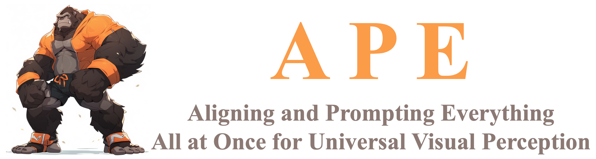
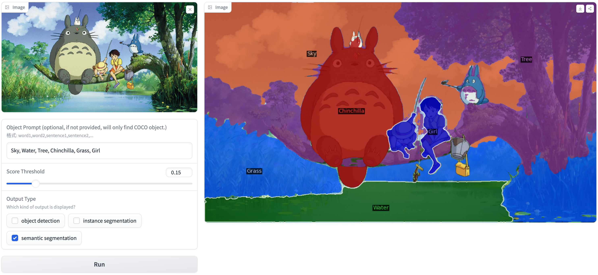
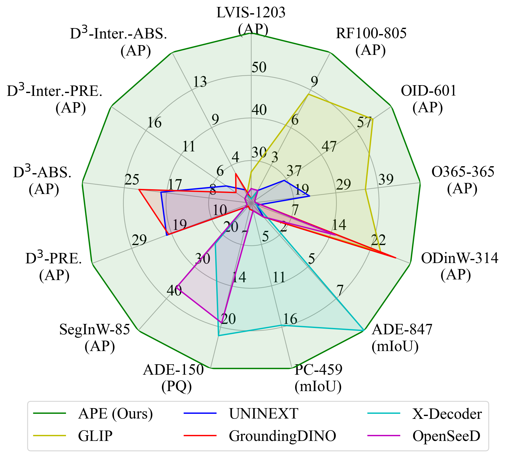

# APE: Aligning and Prompting Everything All at Once for Universal Visual Perception


<!-- 
<a href='https://github.com/shenyunhang/APE'></a>
<a href='https://arxiv.org/abs/2312.02153'></a>
<a href='https://huggingface.co/spaces/shenyunhang/APE'></a>
<a href='https://huggingface.co/shenyunhang/APE'></a>
[](https://github.com/tatsu-lab/stanford_alpaca/blob/main/LICENSE)
-->

<p align="center">
    
</p>


<font size=7><div align='center' > :grapes: \[[Read our arXiv Paper](https://arxiv.org/abs/2312.02153)\] &nbsp; :apple: \[[Try our Online Demo](https://huggingface.co/spaces/shenyunhang/APE)\] </div></font>


---

<p align="center">
    
</p>


## :bulb: Highlight

- **High Performance.**  SotA (or competitive) performance on **160** datasets with only one model.
- **Perception in the Wild.** Detect and segment **everything** with thousands of vocabularies or language descriptions all at once.
- **Flexible.** Support both foreground objects and background stuff for instance segmentation and semantic segmentation.

## :fire: News
* **`2024.04.07`** Release checkpoints for APE-Ti with only 6M backbone!
* **`2024.02.27`** APE has been accepted to CVPR 2024!
* **`2023.12.05`** Release training codes!
* **`2023.12.05`** Release checkpoints for APE-L!
* **`2023.12.05`** Release inference codes and demo!

## :label: TODO 

- [x] Release inference code and demo.
- [x] Release checkpoints.
- [x] Release training codes.
- [ ] Add clean docs.


## :hammer_and_wrench: Install 

1. Clone the APE repository from GitHub:

```bash
git clone https://github.com/shenyunhang/APE
cd APE
```

2. Install the required dependencies and APE:

```bash
pip3 install -r requirements.txt
python3 -m pip install -e .
```


## :arrow_forward: Demo Localy

**Web UI demo**
```
pip3 install gradio
cd APE/demo
python3 app.py
```
This demo will detect GPUs and use one GPU if you have GPUs.

Please feel free to try our [Online Demo](https://huggingface.co/spaces/shenyunhang/APE)!

<p align="center">

</p>


## :books: Data Prepare
Following [here](https://github.com/shenyunhang/APE/blob/main/datasets/README.md) to prepare the following datasets:

|  Name |   COCO  |   LVIS  |  Objects365 | Openimages | VisualGenome |  SA-1B  |   RefCOCO  |   GQA   | PhraseCut | Flickr30k |         |
|:-----:|:-------:|:-------:|:-----------:|:----------:|:------------:|:-------:|:----------:|:-------:|:---------:|:---------:|:-------:|
| Train | &check; | &check; |   &check;   |   &check;  |    &check;   | &check; |   &check;  | &check; |  &check;  |  &check;  |         |
|  Test | &check; | &check; |   &check;   |   &check;  |    &cross;   | &cross; |   &check;  | &cross; |  &cross;  |  &cross;  |         |
|       |         |         |             |            |              |         |            |         |           |           |         |
| Name  |  ODinW  |  SegInW | Roboflow100 |   ADE20k   |   ADE-full   |  BDD10k | Cityscapes |  PC459  |    PC59   |    VOC    |    D3   |
| Train | &cross; | &cross; |   &cross;   |   &cross;  |    &cross;   | &cross; |   &cross;  | &cross; |  &cross;  |  &cross;  | &cross; |
|  Test | &check; | &check; |   &check;   |   &check;  |    &check;   | &check; |   &check;  | &check; |  &check;  |  &check;  | &check; |

Noted we do not use `coco_2017_train` for training.

Instead, we augment `lvis_v1_train` with annotations from coco, and keep the image set unchanged.

And we register it as `lvis_v1_train+coco` for instance segmentation and `lvis_v1_train+coco_panoptic_separated` for panoptic segmentation.


## :test_tube: Inference

### Infer on 160+ dataset
We provide several scripts to evaluate all models.

It is necessary to adjust the checkpoint location and GPU number in the scripts before running them.

```bash
scripts/eval_APE-L_D.sh
scripts/eval_APE-L_C.sh
scripts/eval_APE-L_B.sh
scripts/eval_APE-L_A.sh
scripts/eval_APE-Ti.sh
```

### Infer on images or videos

APE-L_D
```
python3 demo/demo_lazy.py \
--config-file configs/LVISCOCOCOCOSTUFF_O365_OID_VGR_SA1B_REFCOCO_GQA_PhraseCut_Flickr30k/ape_deta/ape_deta_vitl_eva02_clip_vlf_lsj1024_cp_16x4_1080k.py \
--input image1.jpg image2.jpg image3.jpg \
--output /path/to/output/dir \
--confidence-threshold 0.1 \
--text-prompt 'person,car,chess piece of horse head' \
--with-box \
--with-mask \
--with-sseg \
--opts \
train.init_checkpoint=/path/to/APE-D/checkpoint \
model.model_language.cache_dir="" \
model.model_vision.select_box_nums_for_evaluation=500 \
model.model_vision.text_feature_bank_reset=True \
```

To disable `xformers`, add the following option:
```
model.model_vision.backbone.net.xattn=False \
```

To use `pytorch` version of `MultiScaleDeformableAttention`, add the following option:
```
model.model_vision.transformer.encoder.pytorch_attn=True \
model.model_vision.transformer.decoder.pytorch_attn=True \
```


## :train: Training

### Prepare backbone and language models
```bash
git lfs install
git clone https://huggingface.co/QuanSun/EVA-CLIP models/QuanSun/EVA-CLIP/
git clone https://huggingface.co/BAAI/EVA models/BAAI/EVA/
git clone https://huggingface.co/Yuxin-CV/EVA-02 models/Yuxin-CV/EVA-02/
```

Resize patch size:
```bash
python3 tools/eva_interpolate_patch_14to16.py --input models/QuanSun/EVA-CLIP/EVA02_CLIP_E_psz14_plus_s9B.pt --output models/QuanSun/EVA-CLIP/EVA02_CLIP_E_psz14to16_plus_s9B.pt --image_size 224
python3 tools/eva_interpolate_patch_14to16.py --input models/QuanSun/EVA-CLIP/EVA01_CLIP_g_14_plus_psz14_s11B.pt --output models/QuanSun/EVA-CLIP/EVA01_CLIP_g_14_plus_psz14to16_s11B.pt --image_size 224
python3 tools/eva_interpolate_patch_14to16.py --input models/QuanSun/EVA-CLIP/EVA02_CLIP_L_336_psz14_s6B.pt --output models/QuanSun/EVA-CLIP/EVA02_CLIP_L_336_psz14to16_s6B.pt --image_size 336
python3 tools/eva_interpolate_patch_14to16.py --input models/Yuxin-CV/EVA-02/eva02/pt/eva02_Ti_pt_in21k_p14.pt --output models/Yuxin-CV/EVA-02/eva02/pt/eva02_Ti_pt_in21k_p14to16.pt --image_size 224
```

### Train APE-L_D

Single node:
```bash
python3 tools/train_net.py \
--num-gpus 8 \
--resume \
--config-file configs/LVISCOCOCOCOSTUFF_O365_OID_VGR_SA1B_REFCOCO_GQA_PhraseCut_Flickr30k/ape_deta/ape_deta_vitl_eva02_clip_vlf_lsj1024_cp_16x4_1080k_mdl.py \
train.output_dir=output/APE/configs/LVISCOCOCOCOSTUFF_O365_OID_VGR_SA1B_REFCOCO_GQA_PhraseCut_Flickr30k/ape_deta/ape_deta_vitl_eva02_clip_vlf_lsj1024_cp_16x4_1080k_mdl_`date +'%Y%m%d_%H%M%S'`
```

Multiple nodes:
```bash
python3 tools/train_net.py \
--dist-url="tcp://${MASTER_IP}:${MASTER_PORT}" \
--num-gpus ${HOST_GPU_NUM} \
--num-machines ${HOST_NUM} \
--machine-rank ${INDEX} \
--resume \
--config-file configs/LVISCOCOCOCOSTUFF_O365_OID_VGR_SA1B_REFCOCO_GQA_PhraseCut_Flickr30k/ape_deta/ape_deta_vitl_eva02_clip_vlf_lsj1024_cp_16x4_1080k_mdl.py \
train.output_dir=output/APE/configs/LVISCOCOCOCOSTUFF_O365_OID_VGR_SA1B_REFCOCO_GQA_PhraseCut_Flickr30k/ape_deta/ape_deta_vitl_eva02_clip_vlf_lsj1024_cp_16x4_1080k_mdl_`date +'%Y%m%d_%H'`0000
```

### Train APE-L_C

Single node:
```bash
python3 tools/train_net.py \
--num-gpus 8 \
--resume \
--config-file configs/LVISCOCOCOCOSTUFF_O365_OID_VGR_SA1B_REFCOCO/ape_deta/ape_deta_vitl_eva02_vlf_lsj1024_cp_1080k.py \
train.output_dir=output/APE/configs/LVISCOCOCOCOSTUFF_O365_OID_VGR_SA1B_REFCOCO/ape_deta/ape_deta_vitl_eva02_vlf_lsj1024_cp_1080k_`date +'%Y%m%d_%H%M%S'`
```

Multiple nodes:
```bash
python3 tools/train_net.py \
--dist-url="tcp://${MASTER_IP}:${MASTER_PORT}" \
--num-gpus ${HOST_GPU_NUM} \
--num-machines ${HOST_NUM} \
--machine-rank ${INDEX} \
--resume \
--config-file configs/LVISCOCOCOCOSTUFF_O365_OID_VGR_SA1B_REFCOCO/ape_deta/ape_deta_vitl_eva02_vlf_lsj1024_cp_1080k.py \
train.output_dir=output/APE/configs/LVISCOCOCOCOSTUFF_O365_OID_VGR_SA1B_REFCOCO/ape_deta/ape_deta_vitl_eva02_vlf_lsj1024_cp_1080k_`date +'%Y%m%d_%H'`0000
```

### Train APE-L_B

Single node:
```bash
python3 tools/train_net.py \
--num-gpus 8 \
--resume \
--config-file configs/LVISCOCOCOCOSTUFF_O365_OID_VGR_REFCOCO/ape_deta/ape_deta_vitl_eva02_vlf_lsj1024_cp_1080k.py \
train.output_dir=output/APE/configs/LVISCOCOCOCOSTUFF_O365_OID_VGR_REFCOCO/ape_deta/ape_deta_vitl_eva02_vlf_lsj1024_cp_1080k_`date +'%Y%m%d_%H%M%S'`
```

Multiple nodes:
```bash
python3 tools/train_net.py \
--dist-url="tcp://${MASTER_IP}:${MASTER_PORT}" \
--num-gpus ${HOST_GPU_NUM} \
--num-machines ${HOST_NUM} \
--machine-rank ${INDEX} \
--resume \
--config-file configs/LVISCOCOCOCOSTUFF_O365_OID_VGR_REFCOCO/ape_deta/ape_deta_vitl_eva02_vlf_lsj1024_cp_1080k.py \
train.output_dir=output/APE/configs/LVISCOCOCOCOSTUFF_O365_OID_VGR_REFCOCO/ape_deta/ape_deta_vitl_eva02_vlf_lsj1024_cp_1080k_`date +'%Y%m%d_%H'`0000
```

### Train APE-L_A

Single node:
```bash
python3 tools/train_net.py \
--num-gpus 8 \
--resume \
--config-file configs/LVISCOCOCOCOSTUFF_O365_OID_VG/ape_deta/ape_deta_vitl_eva02_lsj1024_cp_720k.py \
train.output_dir=output/APE/configs/LVISCOCOCOCOSTUFF_O365_OID_VG/ape_deta/ape_deta_vitl_eva02_lsj1024_cp_720k_`date +'%Y%m%d_%H%M%S'`
```

Multiple nodes:
```bash
python3 tools/train_net.py \
--dist-url="tcp://${MASTER_IP}:${MASTER_PORT}" \
--num-gpus ${HOST_GPU_NUM} \
--num-machines ${HOST_NUM} \
--machine-rank ${INDEX} \
--resume \
--config-file configs/LVISCOCOCOCOSTUFF_O365_OID_VG/ape_deta/ape_deta_vitl_eva02_lsj1024_cp_720k.py \
train.output_dir=output/APE/configs/LVISCOCOCOCOSTUFF_O365_OID_VG/ape_deta/ape_deta_vitl_eva02_lsj1024_cp_720k_`date +'%Y%m%d_%H'`0000
```

### Train APE-Ti

Single node:
```bash
python3 tools/train_net.py \
--num-gpus 8 \
--resume \
--config-file configs/LVISCOCOCOCOSTUFF_O365_OID_VGR_SA1B_REFCOCO_GQA_PhraseCut_Flickr30k/ape_deta/ape_deta_vitt_eva02_vlf_lsj1024_cp_16x4_1080k_mdl.py \
train.output_dir=output/APE/configs/LVISCOCOCOCOSTUFF_O365_OID_VGR_SA1B_REFCOCO_GQA_PhraseCut_Flickr30k/ape_deta/ape_deta_vitt_eva02_vlf_lsj1024_cp_16x4_1080k_mdl_`date +'%Y%m%d_%H%M%S'`
```

Multiple nodes:
```bash
python3 tools/train_net.py \
--dist-url="tcp://${MASTER_IP}:${MASTER_PORT}" \
--num-gpus ${HOST_GPU_NUM} \
--num-machines ${HOST_NUM} \
--machine-rank ${INDEX} \
--resume \
--config-file configs/LVISCOCOCOCOSTUFF_O365_OID_VGR_SA1B_REFCOCO_GQA_PhraseCut_Flickr30k/ape_deta/ape_deta_vitt_eva02_vlf_lsj1024_cp_16x4_1080k_mdl.py \
train.output_dir=output/APE/configs/LVISCOCOCOCOSTUFF_O365_OID_VGR_SA1B_REFCOCO_GQA_PhraseCut_Flickr30k/ape_deta/ape_deta_vitt_eva02_vlf_lsj1024_cp_16x4_1080k_mdl_`date +'%Y%m%d_%H'`0000
```


## :luggage: Checkpoints

```
git lfs install
git clone https://huggingface.co/shenyunhang/APE
```

<!-- insert a table -->
<table>
  <thead>
    <tr style="text-align: right;">
      <th></th>
      <th>name</th>
      <th>Checkpoint</th>
      <th>Config</th>
    </tr>
  </thead>
  <tbody>
    <tr>
      <th>1</th>
      <td>APE-L_A</td>
      <td><a href="https://huggingface.co/shenyunhang/APE/blob/main/configs/LVISCOCOCOCOSTUFF_O365_OID_VG/ape_deta/ape_deta_vitl_eva02_lsj_cp_720k_20230504_002019/model_final.pth">HF link</a></td>
      <td><a href="https://github.com/shenyunhang/APE/blob/main/configs/LVISCOCOCOCOSTUFF_O365_OID_VG/ape_deta/ape_deta_vitl_eva02_lsj1024_cp_720k.py">link</a></td>
    </tr>
    <tr>
      <th>2</th>
      <td>APE-L_B</td>
      <td><a href="https://huggingface.co/shenyunhang/APE/blob/main/configs/LVISCOCOCOCOSTUFF_O365_OID_VGR_REFCOCO/ape_deta/ape_deta_vitl_eva02_vlf_lsj_cp_1080k_20230702_225418/model_final.pth">HF link</a> 
      <td><a href="https://github.com/shenyunhang/APE/blob/main/configs/LVISCOCOCOCOSTUFF_O365_OID_VGR_REFCOCO/ape_deta/ape_deta_vitl_eva02_vlf_lsj1024_cp_1080k.py">link</a></td>
    </tr>
    <tr>
      <th>3</th>
      <td>APE-L_C</td>
      <td><a href="https://huggingface.co/shenyunhang/APE/blob/main/configs/LVISCOCOCOCOSTUFF_O365_OID_VGR_SA1B_REFCOCO/ape_deta/ape_deta_vitl_eva02_vlf_lsj_cp_1080k_20230702_210950/model_final.pth">HF link</a> 
      <td><a href="https://github.com/shenyunhang/APE/blob/main/configs/LVISCOCOCOCOSTUFF_O365_OID_VGR_SA1B_REFCOCO/ape_deta/ape_deta_vitl_eva02_vlf_lsj1024_cp_1080k.py">link</a></td>
    </tr>
    <tr>
      <th>4</th>
      <td>APE-L_D</td>
      <td><a href="https://huggingface.co/shenyunhang/APE/blob/main/configs/LVISCOCOCOCOSTUFF_O365_OID_VGR_SA1B_REFCOCO_GQA_PhraseCut_Flickr30k/ape_deta/ape_deta_vitl_eva02_clip_vlf_lsj1024_cp_16x4_1080k_mdl_20230829_162438/model_final.pth">HF link</a> 
      <td><a href="https://github.com/shenyunhang/APE/blob/main/configs/LVISCOCOCOCOSTUFF_O365_OID_VGR_SA1B_REFCOCO_GQA_PhraseCut_Flickr30k/ape_deta/ape_deta_vitl_eva02_clip_vlf_lsj1024_cp_16x4_1080k_mdl.py">link</a></td>
    </tr>
    <tr>
      <th>4</th>
      <td>APE-Ti</td>
      <td><a href="https://huggingface.co/shenyunhang/APE/blob/main/configs/LVISCOCOCOCOSTUFF_O365_OID_VGR_SA1B_REFCOCO_GQA_PhraseCut_Flickr30k/ape_deta/ape_deta_vitt_eva02_vlf_lsj1024_cp_16x4_1080k_mdl_20240203_230000/model_final.pth">HF link</a> 
      <td><a href="https://github.com/shenyunhang/APE/blob/main/configs/LVISCOCOCOCOSTUFF_O365_OID_VGR_SA1B_REFCOCO_GQA_PhraseCut_Flickr30k/ape_deta/ape_deta_vitt_eva02_vlf_lsj1024_cp_16x4_1080k_mdl.py">link</a></td>
    </tr>
  </tbody>
</table>


## :medal_military: Results




## :black_nib: Citation

If you find our work helpful for your research, please consider citing the following BibTeX entry.   

```bibtex
@inproceedings{APE,
  title={Aligning and Prompting Everything All at Once for Universal Visual Perception},
  author={Shen, Yunhang and Fu, Chaoyou and Chen, Peixian and Zhang, Mengdan and Li, Ke and Sun, Xing and Wu, Yunsheng and Lin, Shaohui and Ji, Rongrong},
  journal={CVPR},
  year={2024}
}
```
